# How This Works — AKMS Architecture Guide

> A visual, diagram-heavy walkthrough of every layer in the Agent Knowledge Management System.

---

## 1. High-Level System Overview

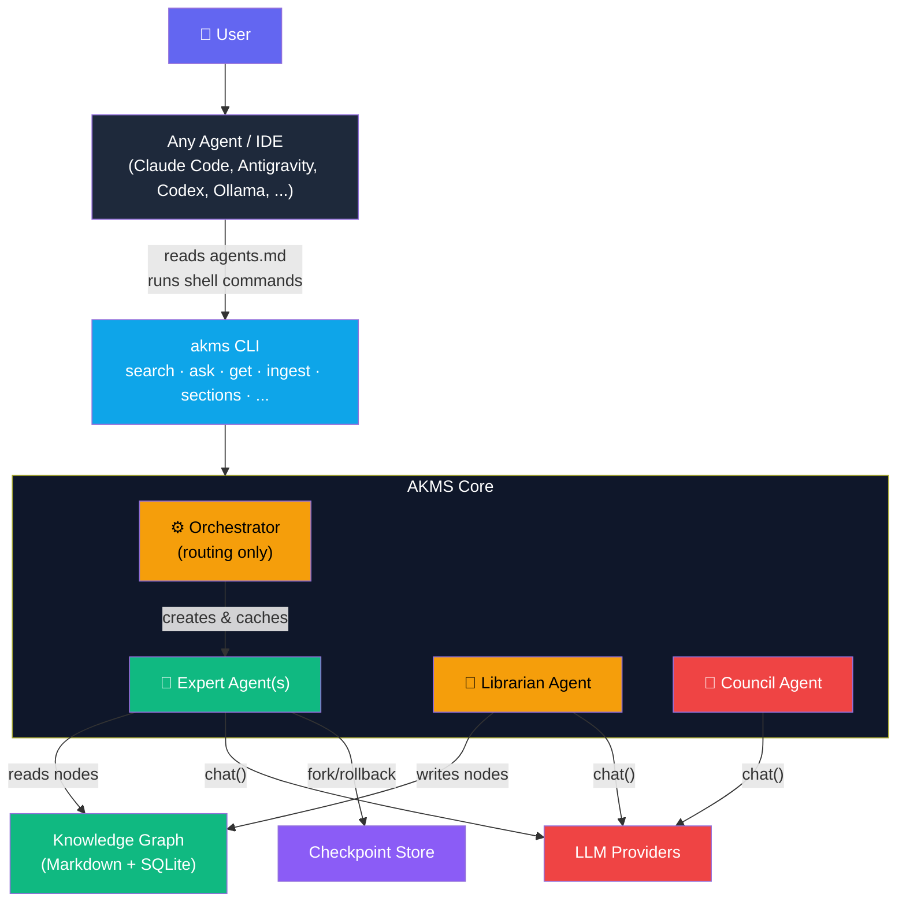

> [!IMPORTANT]
> **The CLI is the universal interface.** Any agent that can run a shell command can use AKMS — no wrapper code, no Python integration, no per-IDE maintenance. The agent reads `agents.md` to learn the available commands, then calls them like skills.

> [!IMPORTANT]
> **The Orchestrator is NOT an agent.** It's a plain Python coordinator class in `core/orchestrator.py` that never calls an LLM. It manages the Expert pool (caching, splitting large sections, routing queries). Think of it as the **switchboard**, not a participant.

**One sentence:** Any agent, from any provider, reads `agents.md` and uses `akms` CLI commands as skills to query, update, and grow a persistent knowledge graph.

---

## 2. Repository File Tree

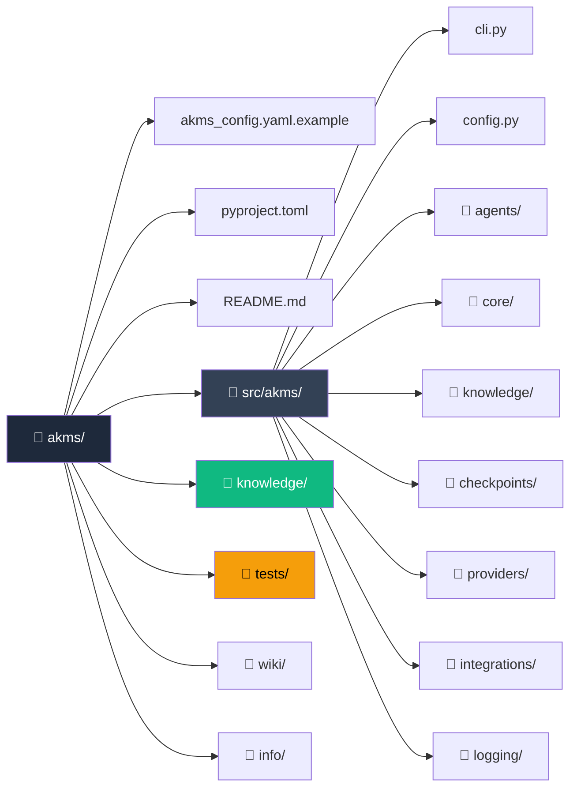

---

## 3. What Every File Does

### Root Files

| File | Purpose |
|---|---|
| `pyproject.toml` | Package metadata, deps (`pyyaml`, `click`, `anthropic`, `openai`, `aiosqlite`), CLI entry point `akms = akms.cli:main` |
| `akms_config.yaml.example` | Reference config — providers, agent assignments, budget, knowledge paths, expert thresholds |
| `README.md` | Full user-facing docs, CLI reference, Python API examples |

### `src/akms/` — The Main Package

| File | Purpose |
|---|---|
| `__init__.py` | Exports `__version__` |
| `cli.py` | Click CLI — `init`, `chat`, `ingest`, `status`, `budget`, `research`, `overlay` commands |
| `config.py` | Dataclasses (`ProviderConfig`, `AgentAssignment`, `BudgetConfig`, `KnowledgeConfig`, `ExpertConfig`, `AKMSConfig`) + YAML loader with `${ENV_VAR}` resolution |

### `src/akms/agents/`

| File | Class | Purpose |
|---|---|---|
| `base.py` | `BaseAgent` | Abstract base — `send()`, `ask()`, `reset()`, token tracking, JSONL logging, session management |
| `executor.py` | `ExecutorAgent` | Primary chat agent — detects `query_knowledge` JSON tool calls in LLM output, routes them through orchestrator, loops up to 5 rounds |
| `expert.py` | `ExpertAgent` | Owns one knowledge section — `load_section()` builds system prompt from nodes, `answer()` uses fork/rollback (throwaway conversation branch) |
| `librarian.py` | `LibrarianAgent` | Knowledge curator — `ingest_log()` extracts insights from JSONL, `digest_document()` chunks markdown by heading, `check_consistency()` finds broken wikilinks, `archive_node()` moves nodes to archives |
| `council.py` | `CouncilAgent` | 5-role deliberation (Advocate, Critic, Historian, Innovator, Synthesizer) — does NOT extend BaseAgent |

### `src/akms/core/`

| File | Class | Purpose |
|---|---|---|
| `message.py` | `Role`, `Message`, `Response`, `Conversation` | Provider-agnostic message schema — serializable to/from dict, `Conversation.fork_at()` for branching |
| `budget.py` | `BudgetTracker`, `UsageRecord` | In-memory cost tracking — `record_usage()`, `daily_total_usd()`, `is_over_limit()`, `summary()` |
| `orchestrator.py` | `Orchestrator` | Central coordinator — expert pool cache, dynamic expert scaling (splits large sections into chunk experts), `query_expert()` with keyword-overlap routing for split sections |

### `src/akms/knowledge/`

| File | Class | Purpose |
|---|---|---|
| `wiki.py` | `WikiLayer` | Markdown filesystem layer — YAML frontmatter + `# Title` + content, `[[wikilink]]` parsing, CRUD for nodes organized in section directories |
| `db.py` | `SQLiteLayer` | Structured SQLite store — `nodes`, `edges`, `provenance`, `search_index` tables, keyword search via `LIKE` |
| `graph.py` | `HybridGraph` | Unified facade — writes to both wiki + SQLite, `sync_links()` parses wikilinks into DB edges, delegates search to `GraphSearch` |
| `search.py` | `GraphSearch` | Tokenized keyword search — splits query into tokens, scores nodes by token-hit count, returns ranked results |
| `user_overlay.py` | `UserOverlay` | JSON file storing per-concept understanding scores (0.0–1.0) with notes and review dates |
| `schema.sql` | — | SQLite DDL for `nodes`, `edges`, `provenance`, `search_index` |

### `src/akms/checkpoints/`

| File | Class/Function | Purpose |
|---|---|---|
| `store.py` | `CheckpointStore` | SQLite-backed checkpoint persistence — `save()`, `load()`, `get_home_state_id()`, `list_checkpoints()` |
| `fork.py` | `fork_from_checkpoint()`, `discard_fork()`, `restore_home_state()` | Fork/rollback helpers — create throwaway conversation branches from checkpoints, discard after use |
| `schema.sql` | — | SQLite DDL for `checkpoints` and `forks` tables |

### `src/akms/providers/`

| File | Class | Purpose |
|---|---|---|
| `base.py` | `LLMProvider` (ABC) | Abstract interface — `chat()`, `stream()`, `count_tokens()`, `_to_provider_format()`, `_from_provider_response()` |
| `registry.py` | `ProviderRegistry` | Factory pattern — `register()`, `create()`, `create_from_config()`. `build_default_registry()` lazy-loads all built-in providers |
| `claude.py` | `ClaudeProvider` | Anthropic adapter — handles system prompt separation, token counting via API |
| `openai_provider.py` | `OpenAIProvider` | OpenAI/GPT adapter |
| `gemini.py` | `GeminiProvider` | Google Gemini adapter |
| `deepseek.py` | `DeepSeekProvider` | DeepSeek adapter (OpenAI-compatible) |
| `ollama.py` | `OllamaProvider` | Local Ollama adapter |

### `src/akms/integrations/`

| File | Class | Purpose |
|---|---|---|
| `generic.py` | `GenericWrapper` | Base wrapper — injects AKMS system prompt listing available sections + tool protocol, handles multi-round tool call loops |
| `claude_code.py` | `ClaudeCodeWrapper` | Tuned for Claude Code — `graph:section/node-id` references |
| `codex.py` | `CodexWrapper` | Tuned for OpenAI Codex |
| `opencode.py` | `OpenCodeWrapper` | Tuned for OpenCode — checks architectural decisions first |

### `src/akms/logging/`

| File | Class | Purpose |
|---|---|---|
| `conversation_log.py` | `ConversationLogger` | JSONL conversation logger — one file per `{date}_{conversation_id}.jsonl`, organized by agent type |
| `token_tracker.py` | `TokenTracker` | JSONL token usage logger — `log()`, `load_today()`, `load_all()` |

### `knowledge/` — Runtime Data

| Path | Purpose |
|---|---|
| `knowledge/graph/` | Markdown node files organized by section subdirectories |
| `knowledge/archives/` | Archived (retired) nodes with archive reason |
| `knowledge/logs/` | JSONL conversation logs and token usage |
| `knowledge/user_overlay/` | `understanding.json` — user concept scores |
| `knowledge/research_queue.md` | Knowledge gaps flagged by the Librarian |

### `tests/` — Test Suite

| File | What it tests |
|---|---|
| `conftest.py` | Shared fixtures (tmp dirs, mock providers, sample configs) |
| `test_config.py` | Config loading, env var resolution, defaults |
| `test_db.py` | SQLite layer CRUD, search index, edges |
| `test_wiki.py` | Wiki layer file I/O, frontmatter parsing, wikilinks |
| `test_message.py` | Message/Response serialization, Conversation forking |
| `test_budget.py` | BudgetTracker daily totals, limits, warnings |
| `test_checkpoints.py` | Checkpoint save/load, home state, forks |
| `test_expert.py` | Expert section loading, fork-based answering |
| `test_executor.py` | Tool call detection and routing |
| `test_librarian.py` | Log ingestion, document digestion, consistency checks, archival |
| `test_orchestrator.py` | Expert pool caching, dynamic splitting, query routing |
| `test_council.py` | Council deliberation flow |
| `test_registry.py` | Provider registration and creation |
| `test_search.py` | Keyword search ranking |
| `test_user_overlay.py` | Overlay CRUD, score clamping |
| `test_integration.py` | End-to-end flows |
| `test_edge_cases.py` | Error handling, missing files, empty states |

---

## 4. The Chat Flow — Step by Step

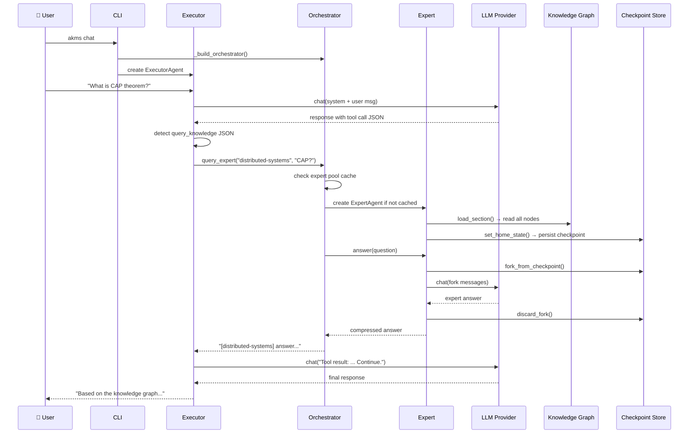

---

## 5. The Ingestion Flow

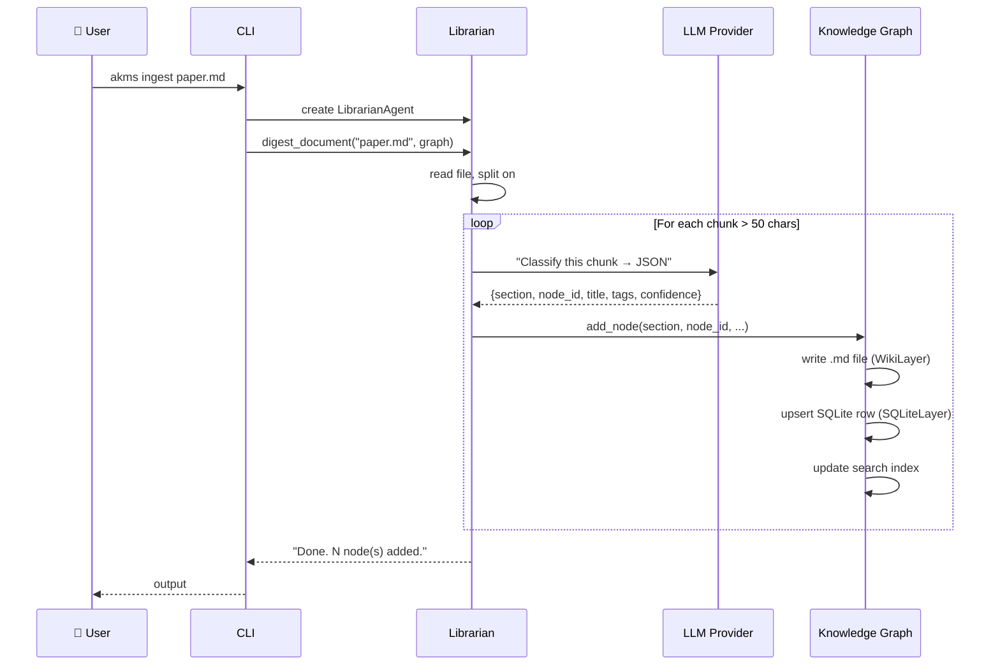

---

## 6. Knowledge Graph — Dual Storage

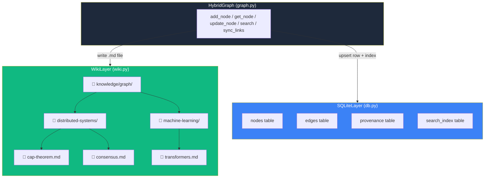

### Node Markdown Format

```
---
id: cap-theorem
section: distributed-systems
created: 2026-05-10
tags: [consistency, availability]
confidence: 0.92
sources: []
---

# CAP Theorem

Content here...

## Connections
- [[consensus]]       ← creates a graph edge
```

### SQLite Schema

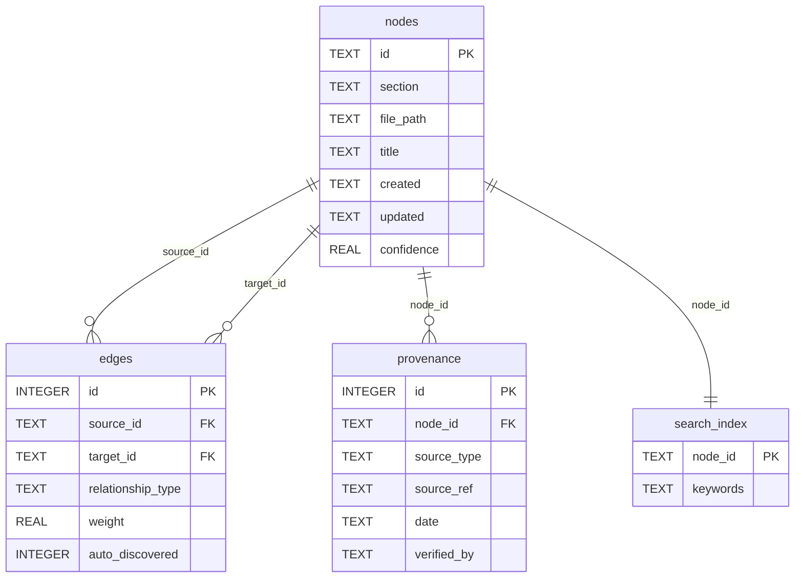

---

## 7. The Four Agent Types

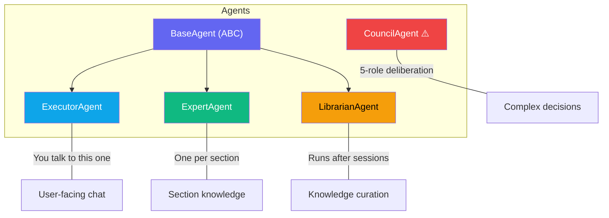

> ⚠️ `CouncilAgent` does **not** extend `BaseAgent` — it calls `provider.chat()` directly.

### BaseAgent Responsibilities

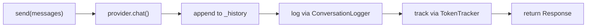

---

## 8. Expert Fork/Rollback Pattern

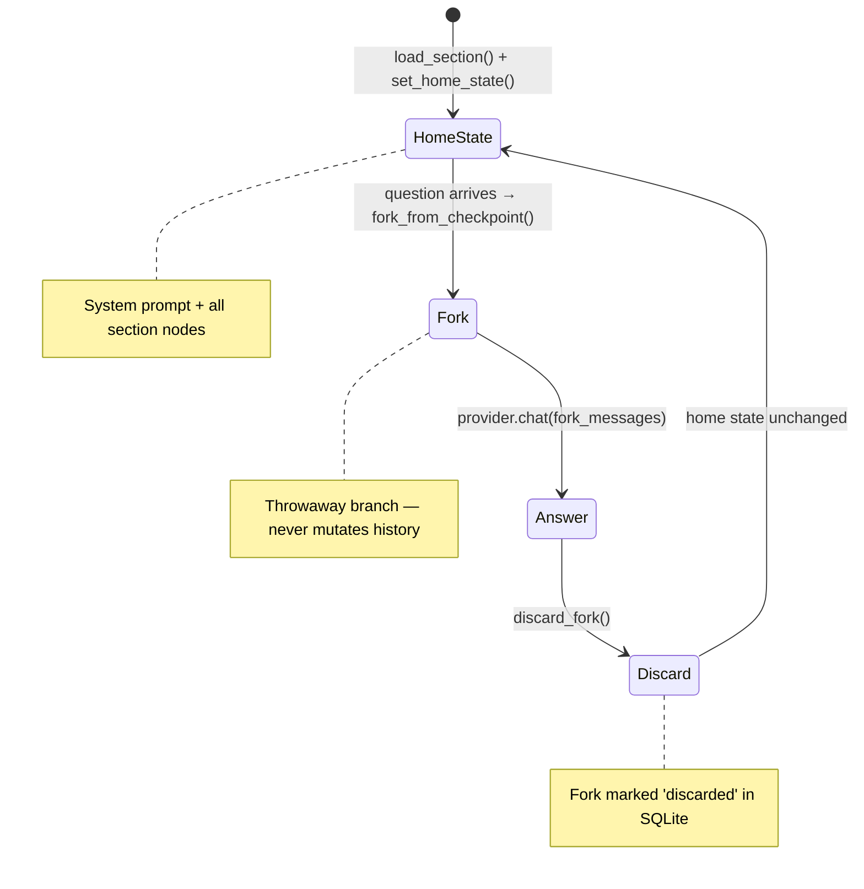

**Why?** Each Expert Q&A is a throwaway branch. The Expert's home state stays clean — no accumulated context drift across queries.

---

## 9. Dynamic Expert Scaling

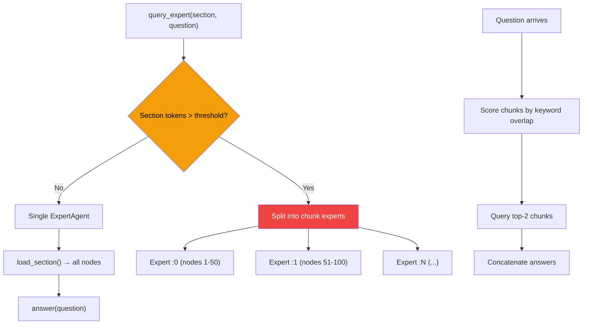

**Pool keying:**
- Single sections: `"distributed-systems"`
- Split sections: `"distributed-systems:0"`, `"distributed-systems:1"`, ...
- Sentinel: `"distributed-systems:__split__"` stores the chunk key list

---

## 10. Provider Abstraction

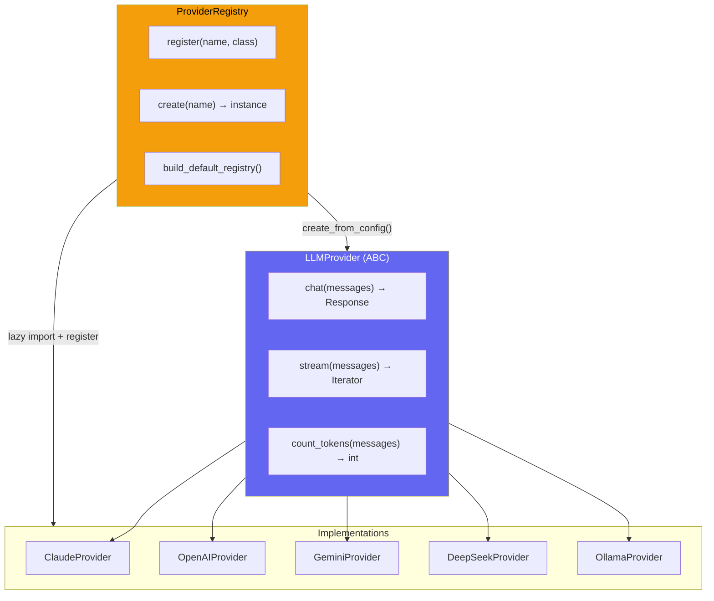

All providers normalize to the same `Message` / `Response` types. Swap providers by changing `agent_assignments` in config — zero code changes.

---

## 11. Configuration Loading

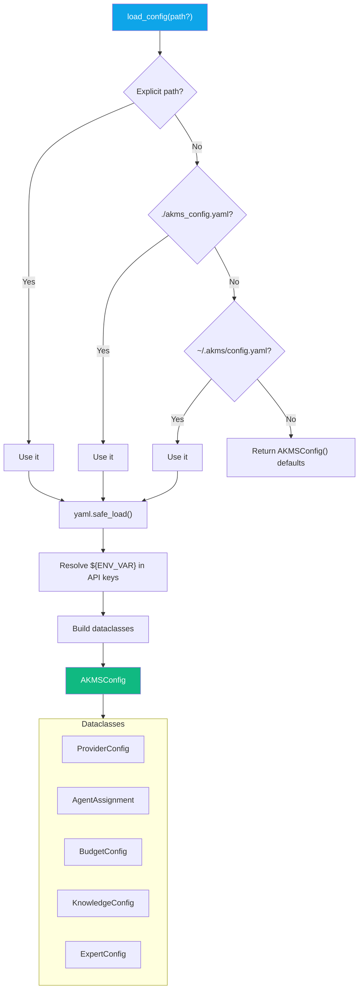

---

## 12. CLI Command Map

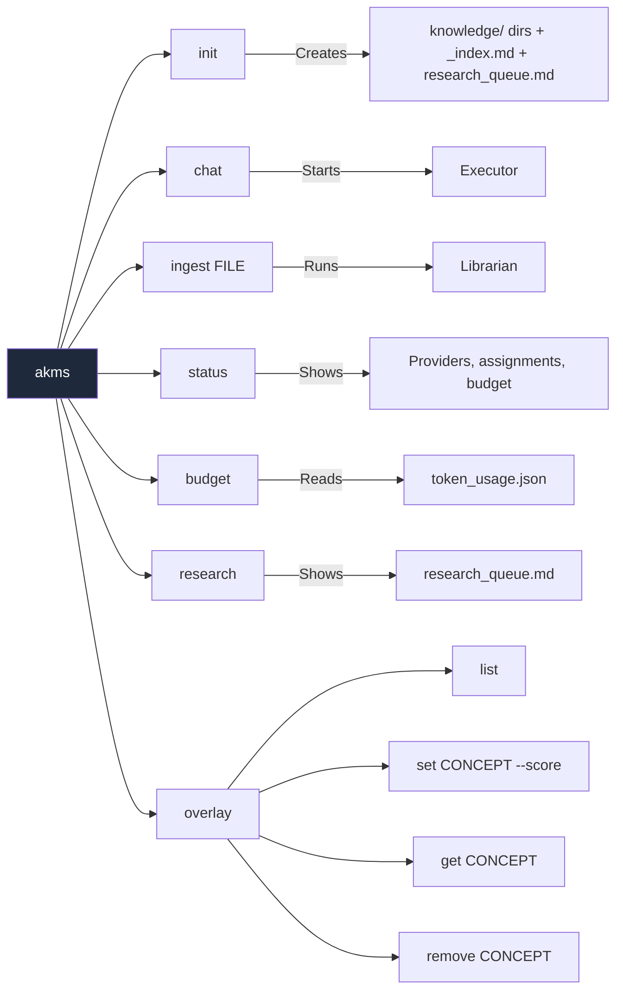

---

## 13. Integration Wrappers

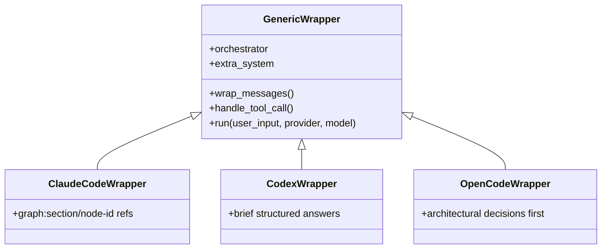

These inject an AKMS system prompt into any existing tool session, enabling knowledge graph queries from within Claude Code, Codex, or OpenCode.

---

## 14. Logging & Token Tracking

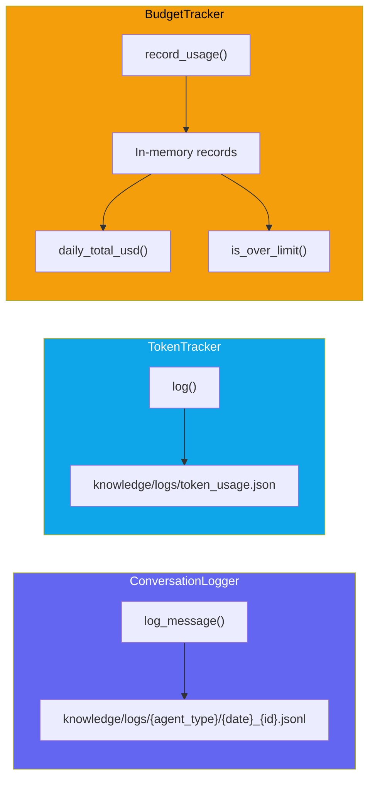

---

## 15. Checkpoint & Fork Database

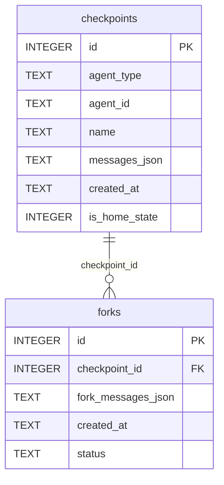

- **Home state checkpoints** (`is_home_state=1`): Expert's system prompt + loaded section knowledge
- **Forks**: Throwaway Q&A branches — created from checkpoints, discarded after answering

---

## 16. Council Deliberation Flow

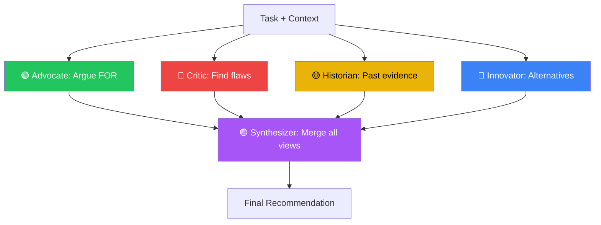

Each role is a separate LLM call with a role-specific system prompt. The Synthesizer sees all four perspectives and produces the final recommendation.

---

## 17. Data Flow Summary

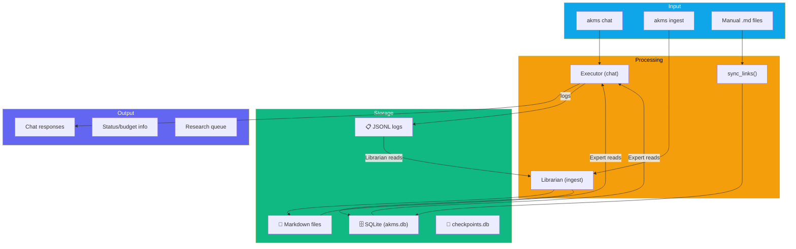

---

## 18. Known Architectural Decisions

| Decision | Rationale |
|---|---|
| **Dual storage (Wiki + SQLite)** | Markdown is human-readable and git-friendly; SQLite enables fast search and relational queries |
| **Fork/rollback for Experts** | Prevents context drift — each Q&A is isolated, home state never mutated |
| **Text-based tool protocol** | LLM outputs JSON tool calls as text, parsed by string matching — simple, provider-agnostic |
| **Lazy provider imports** | Only loads provider dependencies that are installed — avoids requiring all SDKs |
| **Chunk expert splitting** | Large sections auto-split at `token_threshold` with keyword-overlap routing to top-2 chunks |
| **CouncilAgent standalone** | Does not extend BaseAgent — 5 separate LLM calls don't need shared history |
