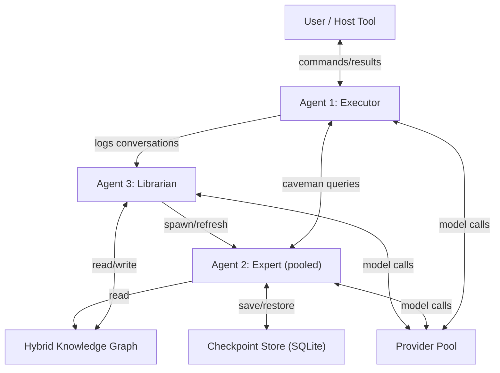
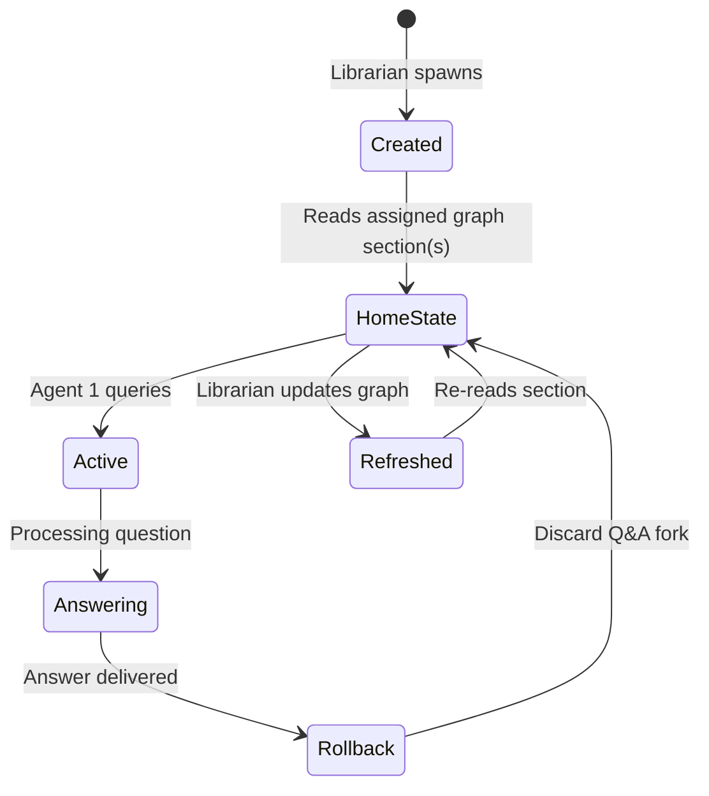

# Agent Knowledge Management System (AKMS) — Architecture Plan

## Overview

A **provider/model-agnostic** standalone Python library that manages knowledge for AI agents through three specialized agent roles and a hybrid knowledge graph. Designed to integrate into existing workflows (Claude Code, Codex, OpenCode, OpenACP, etc.) as a wrapper that feels like middleware.

**Downstream consumers:** Meta Learning System, AI-First OS.

---

## System Architecture



---

## 1. Hybrid Knowledge Graph

### Storage: Dual-Layer

| Layer | Format | Purpose |
|-------|--------|---------|
| **Wiki Layer** | Markdown files with `[[wikilinks]]` in a directory tree | Human-readable, git-friendly, text-based connections |
| **Structured Layer** | SQLite database | Programmatic queries, relationship metadata, provenance, search indices |

### Directory Structure

```
knowledge/
├── graph/
│   ├── _index.md              # Root map of all sections
│   ├── distributed-systems/
│   │   ├── _section.md        # Section overview + links
│   │   ├── cap-theorem.md
│   │   └── consensus.md
│   ├── machine-learning/
│   │   ├── _section.md
│   │   ├── transformers.md
│   │   └── backpropagation.md
│   └── ...
├── archives/                  # Deprecated/incorrect knowledge (never deleted)
│   └── ...
├── user_overlay/              # Personal knowledge layer (for Meta Learning System)
│   ├── understanding.json     # "I understand X well / struggle with Y"
│   └── learning_goals.md
└── schema.sql                 # SQLite schema for structured layer
```

### Wiki Markdown Format

Each knowledge node is a markdown file:

```markdown
---
id: "cap-theorem"
section: "distributed-systems"
created: "2026-05-10"
sources:
  - type: "paper"
    title: "Brewer's CAP Theorem"
    date: "2000-07-19"
  - type: "conversation"
    chat_id: "abc123"
    date: "2026-05-10"
tags: ["consistency", "availability", "partition-tolerance"]
confidence: 0.92
---

# CAP Theorem

Content here...

## Connections
- [[consistency-models]] — CAP defines the tradeoff space
- [[distributed-databases]] — practical implementations
- [[consensus]] — related but distinct problem
```

### SQLite Structured Layer

Tracks relationships, provenance, search, and metadata that's hard to express in markdown:

- **nodes** — id, section, file_path, title, created, updated, confidence
- **edges** — source_id, target_id, relationship_type, weight, auto_discovered
- **provenance** — node_id, source_type, source_ref, date, verified_by
- **search_index** — node_id, embedding_vector (optional), keywords

### Auto-Discovery of Connections

The Librarian scans for overlapping concepts across sections and proposes new `[[wikilinks]]`. User can also manually add links.

---

## 2. Agent 1 — The Executor

### Role
Primary reasoning agent. Receives user tasks, plans execution, queries Experts for context, and optionally summons a 5-subagent council for complex/ambiguous tasks.

### Integration Model: "Wrapper That Feels Like Middleware"

```
┌─────────────────────────────────┐
│  AKMS Wrapper                   │
│  ┌───────────────────────────┐  │
│  │ User's preferred tool     │  │
│  │ (Claude Code / Codex /    │  │
│  │  OpenCode / OpenACP /     │  │
│  │  raw API / CLI)           │  │
│  └───────────────────────────┘  │
│  + System prompt injection      │
│  + Tool definitions (query KB)  │
│  + Conversation logging         │
│  + Expert agent dispatch        │
└─────────────────────────────────┘
```

**How it works:**
1. AKMS wraps the user's chosen tool/provider
2. Injects system prompt with AKMS capabilities + available tools
3. Intercepts tool calls to route to Expert Agents or Knowledge Graph
4. Logs all conversations → sends to Librarian for graph integration

### 5-Subagent Council

Triggered by: task complexity score > threshold, ambiguity detected, or user request.

Each subagent gets a different reasoning lens:
1. **Advocate** — argues for the proposed approach
2. **Critic** — finds flaws and risks
3. **Historian** — checks what the knowledge graph says about similar past attempts
4. **Innovator** — proposes alternative approaches
5. **Synthesizer** — merges all perspectives into a recommendation

### Memory Model

- **Session memory**: Current conversation context
- **Persistent memory**: Can resume previous chats (stored in checkpoint system)
- **Knowledge memory**: Queries Expert Agents / Knowledge Graph as needed
- Every conversation is logged and eventually integrated into graph by Librarian

---

## 3. Agent 2 — The Expert (Pooled)

### Role
Specialized context providers. Each Expert "owns" a section of the knowledge graph and can answer questions about it with deep context.

### Lifecycle



### Fork-Based Rollback

1. Expert sits at **Home State** (has read its graph section)
2. Agent 1 asks a question → conversation is **forked** from Home State
3. Expert answers on the fork
4. Answer is extracted and sent to Agent 1
5. Fork is **discarded** — Expert returns to Home State
6. Home State remains clean for next query

### Dynamic Scaling

- Default: 1 Expert per graph section
- If a section exceeds a configurable token threshold → split across multiple Experts
- Expert count adapts based on model context window and cost settings

### Constraint: Sequential Activation

Only one Expert instance active at a time (for resource efficiency). Agent 1 queries sequentially:
> Wake Expert A → get answer → rollback → Wake Expert B → get answer → rollback

> [!NOTE]
> **Pinned for future optimization**: Parallel Expert queries could dramatically speed up multi-section lookups. Worth revisiting once sequential path is stable.

### Caveman Mode Communication

Experts respond in compressed format:
```
Q: "cap theorem relevance to our db design?"
A: "CAP applies. System = AP (avail+partition). Sacrifice strong consistency.
   Use eventual consistency. See: graph:distributed-systems/cap,
   graph:consistency-models/eventual. Confidence: 0.9"
```

---

## 4. Agent 3 — The Librarian

### Role
Knowledge curator, researcher, and Expert manager.

### Responsibilities

| Task | Trigger | Description |
|------|---------|-------------|
| **Log Integration** | After each Executor conversation | Read logs, extract insights, update graph nodes |
| **Paper Digestion** | User uploads a paper/document | Chunk into topics, create/update graph sections |
| **Research** | Detects knowledge gaps OR user request | Proposes research topics (user approves), then searches web, reads, and integrates |
| **Consistency Check** | Daily schedule + on-demand | Scan graph for contradictions, outdated info, broken links |
| **Expert Management** | After graph changes | Spawn new Experts, refresh existing ones, split/merge sections |
| **Archive Management** | When correcting mistakes | Move incorrect knowledge to `archives/` with metadata on why it was wrong |

### Paper Digestion Workflow

```
User uploads paper.pdf
    → Librarian reads + chunks into topics
    → For each topic:
        → If existing section matches: update + add provenance
        → If new topic: create new section in graph
    → Evaluate whether new/updated sections need Expert spawning
        → Factor in: model context cost, section size, user budget
    → Update relationship edges between new and existing sections
```

### Research Queue

The Librarian maintains a `research_queue.md`:
```markdown
## Pending Research (Awaiting User Approval)
- [ ] "Raft consensus algorithm" — gap detected in distributed-systems section
- [ ] "CRDT data structures" — referenced in 3 nodes but no dedicated section

## Approved
- [x] "Vector clock implementations" — approved 2026-05-09

## Completed
- [x] "Paxos algorithm" — integrated 2026-05-08, 3 new nodes created
```

### Mistake Archival

Never delete — always archive with context:
```markdown
---
archived: "2026-05-10"
reason: "Incorrect claim about CAP theorem"
correction: "See graph:distributed-systems/cap-theorem (updated)"
original_source: "conversation abc123"
---
# [ARCHIVED] CAP Theorem — Original Incorrect Version
...
```

---

## 5. Provider Abstraction Layer

### Config: `akms_config.yaml`

```yaml
providers:
  claude:
    api_key: "${CLAUDE_API_KEY}"  # env var reference
    models:
      - claude-sonnet-4
      - claude-opus-4
  openai:
    api_key: "${OPENAI_API_KEY}"
    models:
      - gpt-4o
      - o3
  gemini:
    api_key: "${GEMINI_API_KEY}"
    models:
      - gemini-2.5-pro
  deepseek:
    api_key: "${DEEPSEEK_API_KEY}"
    models:
      - deepseek-chat
  ollama:
    base_url: "http://localhost:11434"
    models:
      - llama3
      - mistral

agent_assignments:
  executor:
    provider: claude
    model: claude-sonnet-4
  expert:
    provider: openai
    model: gpt-4o
  librarian:
    provider: claude
    model: claude-sonnet-4
  council:
    provider: openai
    model: gpt-4o

budget:
  daily_limit_usd: 5.00
  per_query_warn_usd: 0.50
  track_tokens: true
  token_log_path: "knowledge/logs/token_usage.json"
```

### Unified Provider Interface

```python
class LLMProvider(Protocol):
    def chat(self, messages: list[Message], **kwargs) -> Response: ...
    def stream(self, messages: list[Message], **kwargs) -> Iterator[Response]: ...
    def count_tokens(self, messages: list[Message]) -> int: ...
```

All providers implement this interface. Provider-specific features (like Claude's resume) are handled internally by the provider adapter.

---

## 6. Checkpoint System

### Storage: SQLite (`checkpoints.db`)

| Table | Columns |
|-------|---------|
| **checkpoints** | id, agent_type, agent_id, name, messages_json (provider-agnostic), raw_messages (provider-specific), created_at, is_home_state |
| **forks** | id, checkpoint_id, fork_messages_json, created_at, status (active/discarded) |

### Provider-Agnostic Message Format

```json
{
  "role": "assistant",
  "content": "CAP theorem applies...",
  "timestamp": "2026-05-10T03:00:00Z",
  "metadata": {
    "provider": "claude",
    "model": "claude-sonnet-4",
    "tokens_used": 150,
    "graph_refs": ["distributed-systems/cap-theorem"]
  }
}
```

---

## 7. Conversation Logging

### Log Storage

```
knowledge/
└── logs/
    ├── executor/          # Agent 1 conversations
    │   ├── 2026-05-10_abc123.jsonl
    │   └── ...
    ├── expert/            # Agent 2 Q&A exchanges (forks before discard)
    │   └── ...
    ├── librarian/         # Agent 3 activity logs
    │   └── ...
    └── token_usage.json   # Budget tracking
```

All conversations logged as JSONL. Librarian processes these asynchronously to extract knowledge and update the graph.

---

## 8. Budget & Token Tracking

- Track tokens per agent, per provider, per day
- Configurable daily USD limit — system warns and can pause when approaching
- Cost-per-query estimates before execution
- Preinstalled with default cost tables for major providers
- Guidelines for users to add custom provider pricing

---

## 9. User Overlay (Meta Learning System Hook)

```json
{
  "concepts": {
    "cap-theorem": {
      "understanding": 0.8,
      "last_reviewed": "2026-05-09",
      "notes": "Get the theory, need more practice with real systems"
    },
    "paxos": {
      "understanding": 0.3,
      "last_reviewed": "2026-05-07",
      "notes": "Still confusing, need to revisit"
    }
  }
}
```

This layer is separate from the factual graph — it's personal to the user and feeds into the Meta Learning System downstream.

---

## 10. Project Structure

```
akms/
├── pyproject.toml
├── akms_config.yaml.example
├── README.md
├── src/
│   └── akms/
│       ├── __init__.py
│       ├── cli.py                    # CLI entry point
│       ├── config.py                 # Config loading + validation
│       ├── core/
│       │   ├── orchestrator.py       # Main loop, agent coordination
│       │   ├── message.py            # Provider-agnostic message schema
│       │   └── budget.py             # Token tracking + limits
│       ├── agents/
│       │   ├── base.py               # Base agent class
│       │   ├── executor.py           # Agent 1
│       │   ├── expert.py             # Agent 2
│       │   ├── librarian.py          # Agent 3
│       │   └── council.py            # 5-subagent council
│       ├── providers/
│       │   ├── base.py               # LLMProvider protocol
│       │   ├── claude.py
│       │   ├── openai_provider.py
│       │   ├── gemini.py
│       │   ├── deepseek.py
│       │   ├── ollama.py
│       │   └── registry.py           # Provider discovery + factory
│       ├── knowledge/
│       │   ├── graph.py              # Hybrid graph interface
│       │   ├── wiki.py               # Markdown wiki layer
│       │   ├── db.py                 # SQLite structured layer
│       │   ├── search.py             # Search across graph
│       │   └── schema.sql            # DB schema
│       ├── checkpoints/
│       │   ├── store.py              # Checkpoint CRUD
│       │   ├── fork.py               # Fork/rollback logic
│       │   └── schema.sql            # Checkpoint DB schema
│       ├── integrations/
│       │   ├── claude_code.py        # Claude Code wrapper
│       │   ├── codex.py              # Codex wrapper
│       │   ├── opencode.py           # OpenCode wrapper
│       │   └── generic.py            # Generic CLI wrapper
│       └── logging/
│           ├── conversation_log.py   # JSONL conversation logger
│           └── token_tracker.py      # Token/cost tracking
├── knowledge/                        # Default knowledge directory
│   ├── graph/
│   │   └── _index.md                # Empty starter template
│   ├── archives/
│   ├── user_overlay/
│   ├── logs/
│   └── research_queue.md
└── tests/
    └── ...
```

---

## Phased Build Plan

### Phase 1 — Foundation (Weeks 1-2)
- [ ] Project scaffolding (`pyproject.toml`, package structure)
- [ ] Config system (`akms_config.yaml` loading)
- [ ] Provider abstraction layer (start with 2 providers: Claude + OpenAI)
- [ ] Provider-agnostic message schema
- [ ] Basic CLI entry point

### Phase 2 — Knowledge Graph (Weeks 3-4)
- [ ] Wiki layer (markdown files + wikilink parsing)
- [ ] SQLite structured layer (nodes, edges, provenance)
- [ ] Hybrid graph interface (unified read/write across both layers)
- [ ] Graph search (keyword + section-based)
- [ ] Starter templates for empty graph

### Phase 3 — Checkpoint System (Week 5)
- [ ] Checkpoint store (SQLite)
- [ ] Fork/rollback mechanism
- [ ] Home state management for Experts

### Phase 4 — Agent 2: Expert (Weeks 5-6)
- [ ] Expert agent with graph section reading
- [ ] Fork-based Q&A with rollback
- [ ] Caveman mode communication format
- [ ] Dynamic Expert scaling logic

### Phase 5 — Agent 3: Librarian (Weeks 6-8)
- [ ] Conversation log ingestion → graph updates
- [ ] Paper/document digestion pipeline
- [ ] Research queue with user approval
- [ ] Consistency checking (daily + on-demand)
- [ ] Mistake archival system
- [ ] Expert management (spawn/refresh)

### Phase 6 — Agent 1: Executor (Weeks 8-10)
- [ ] Orchestrator (main loop, Expert dispatch)
- [ ] Integration wrappers (Claude Code, Codex, OpenCode)
- [ ] 5-subagent council
- [ ] Conversation logging pipeline

### Phase 7 — Budget & Polish (Weeks 10-11)
- [ ] Token tracking + budget limits
- [ ] Add remaining providers (Gemini, DeepSeek, Ollama)
- [ ] User overlay system (Meta Learning hook)
- [ ] CLI polish + documentation

### Phase 8 — Testing & Hardening (Weeks 11-12)
- [ ] Unit tests for all core modules
- [ ] Integration tests (multi-agent flows)
- [ ] Edge cases (large graphs, budget exhaustion, provider failures)
- [ ] README + setup guide

---

## Open Questions

> [!IMPORTANT]
> **Graph bootstrapping instructions** — You mentioned the system should have instructions on how to create and organize the graph. Should these be:
> - A static markdown guide the Librarian follows?
> - A dynamic "graph schema" that defines required sections and relationships?
> - Both?

> [!IMPORTANT]
> **Integration priority** — Which wrapper should we build first? Claude Code? Raw API CLI? This determines the Phase 6 starting point.

> [!NOTE]
> **Parallel Expert queries (pinned)** — Currently designed as sequential. Revisit after Phase 4 is stable. Could unlock significant speed improvements for multi-section lookups at the cost of higher concurrent resource usage.

---

## Verification Plan

### Automated Tests
- Unit tests for each module (provider adapters, graph CRUD, checkpoint fork/rollback)
- Integration test: full flow from user query → Expert consultation → graph update
- Budget tracking accuracy tests

### Manual Verification
- End-to-end: upload a paper → Librarian digests → Expert created → Executor queries Expert
- Provider switching: run same query through Claude, OpenAI, and local model
- Rollback correctness: verify Expert Home State is unchanged after Q&A fork
